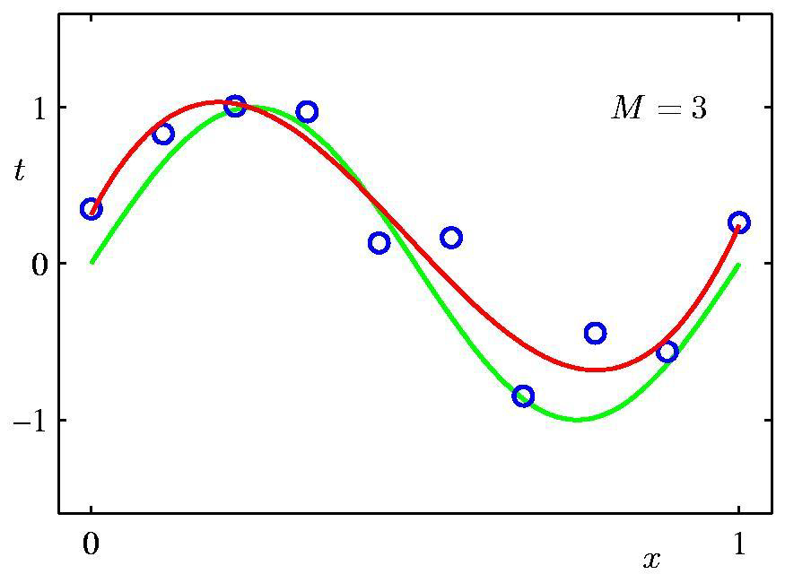
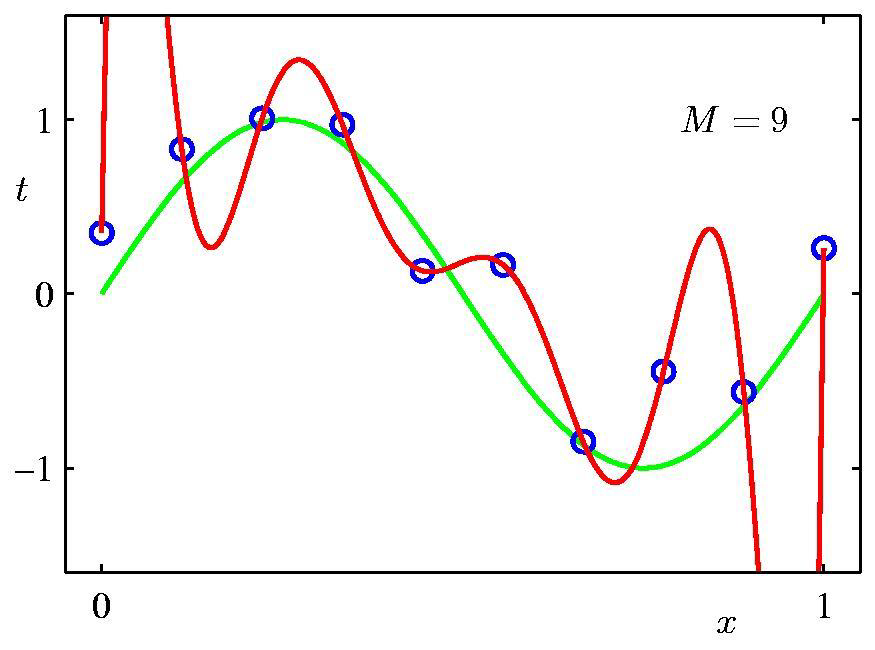
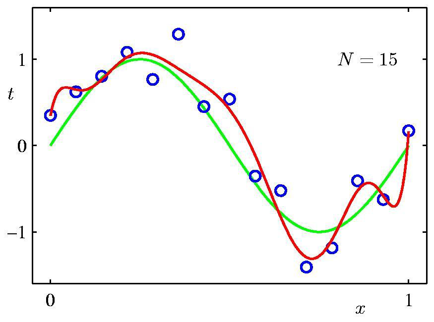
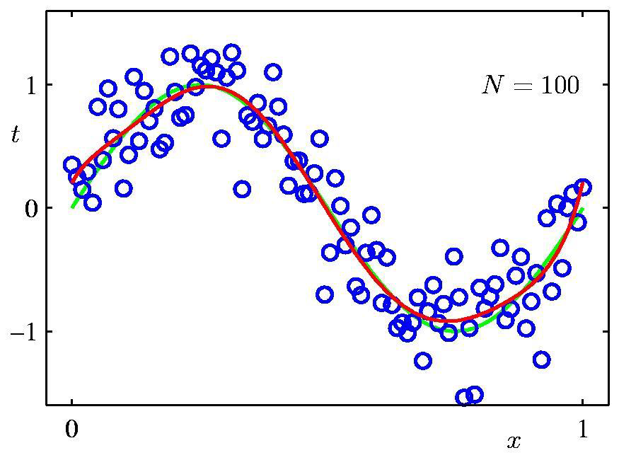
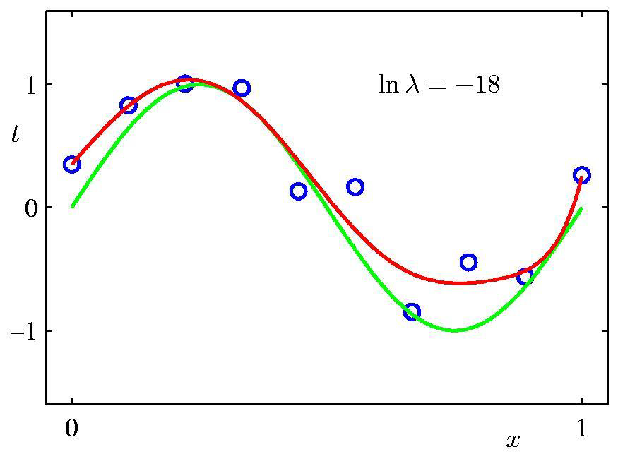

# Homework 01

## Goal

Implement polynomial curve fitting in python and with TensorFlow (optionally).

1. sample the function curve of y=sin(x) with Gaussian noise 

2. fit degree 3 and 9 curves in 10 samples 

3. fit degree 9 curves in 15 and 100 samples  

4. fit degree 9 curve in 10 samples but with regularization term 

## Requirements

+ Programming lanuage: [python3](https://docs.python.org/3/tutorial/)
+ Optional package: [tensorflow web](https://www.tensorflow.org/)
+ Plot the results in [matplotlib](http://matplotlib.org/) [Introduction in Chinese](http://www.ibm.com/developerworks/cn/linux/l-matplotlib/index.html) [Tutorial](http://www.ast.uct.ac.za/~sarblyth/pythonGuide/PythonPlottingBeginnersGuide.pdf)

