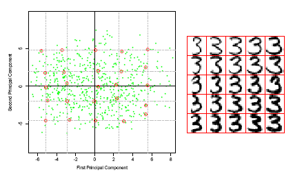

# Homework 02
  
## Goal

Represent digits '3' in 2D.

+  convert data from the UCI [Optical Recognition of Handwritten Digits Data Set](http://archive.ics.uci.edu/ml/datasets/Optical+Recognition+of+Handwritten+Digits)
+ perform PCA over all digit '3' with 2 components
+ plot the PCA results as below (also in page #12 of PCA  )

## Requirements

+ Programming lanuage: [python3](https://docs.python.org/3/tutorial/)
+ Optional package: [tensorflow web](https://www.tensorflow.org/)
+ Plot the results in [matplotlib](http://matplotlib.org/) [Introduction in Chinese](http://www.ibm.com/developerworks/cn/linux/l-matplotlib/index.html) [Tutorial](http://www.ast.uct.ac.za/~sarblyth/pythonGuide/PythonPlottingBeginnersGuide.pdf)

## Bonus
Process this data set (include all digits) in Deep Learning methods, and visualize “threes” in the same way.

