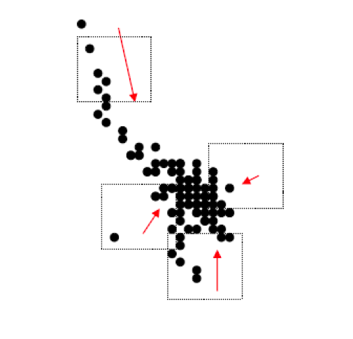
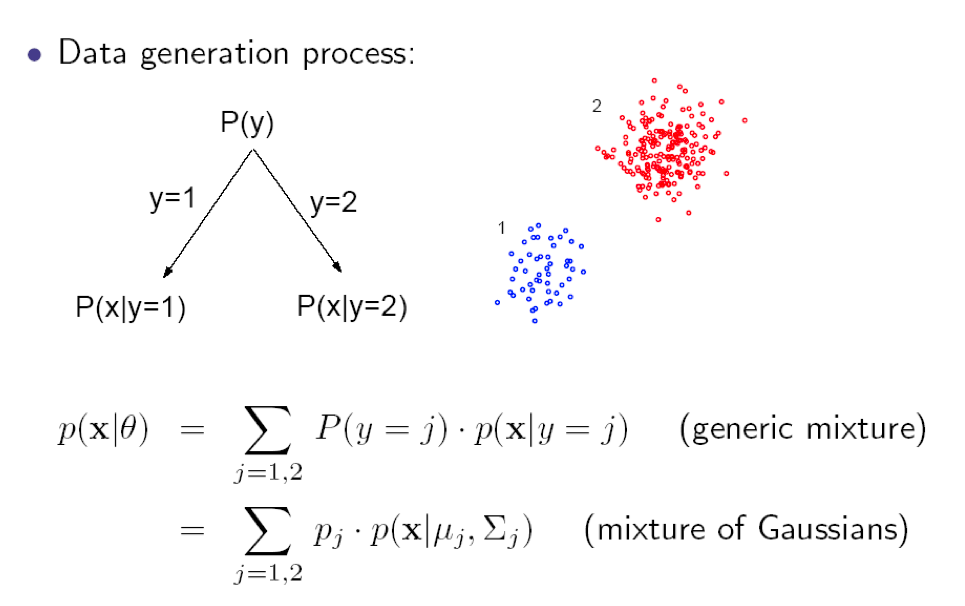

# Homework 03
  
## Goal

Implement the mean-shift algorithm.

+ Generate sampling points from a 2D Gaussian distribution
+ Generate sampling points from a 2D Mixture of Gaussian (MOG) distribution

+ Estimate  of generated data via step2 by using the Mean-Shift method
+ Plot the clustering results

## Requirements

+ Programming lanuage: [python3](https://docs.python.org/3/tutorial/)
+ Optional package: [tensorflow web](https://www.tensorflow.org/)
+ Plot the results in [matplotlib](http://matplotlib.org/) [Introduction in Chinese](http://www.ibm.com/developerworks/cn/linux/l-matplotlib/index.html) [Tutorial](http://www.ast.uct.ac.za/~sarblyth/pythonGuide/PythonPlottingBeginnersGuide.pdf)

## Bonus

+ implement MOG in 2-D case
+ add the regularization term to the MoG implementation
